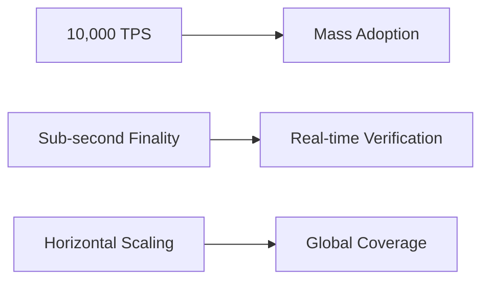

# RealmLINK - Decentralized Trust Infrastructure on Sui Move

## 🌟 Introduction

RealmLINK is building trust infrastructure for real-world activities on Sui Move, featuring:

- **Biometric-Backed Digital Assets**: Using Sui's object model for RWA-NFT tickets
- **Zero-Knowledge Identity Proofs**: Leveraging Move's security for privacy-preserving verification
- **High-Throughput Event Processing**: Utilizing Sui's parallel execution for mass adoption scenarios

## 🚀 Three-Phase Roadmap (Sui Move Implementation)

### Phase 1: Trust Base Layer (0-12 Months)
```move
module realmlink::ticket {
    struct Ticket has key, store {
        id: UID,
        event_id: vector<u8>,
        biometric_hash: vector<u8>,
        metadata: vector<u8>
    }

    public entry fun mint_ticket(
        ctx: &mut TxContext,
        event_id: vector<u8>,
        biometric_proof: vector<u8>
    ) {
        let bio_hash = verify_biometric(biometric_proof);
        let ticket = Ticket {
            id: object::new(ctx),
            event_id,
            biometric_hash: bio_hash,
            metadata: b""
        };
        transfer::public_transfer(ticket, tx_context::sender(ctx));
    }
}
```

**Sui-Specific Milestones**:
- [x] Sui Move Smart Contract Audit
- [x] Sui Object Model for Ticket NFTs
- [ ] On-Chain Biometric Proof Verification
- [ ] Sui Testnet Deployment

### Phase 2: Data Value Layer (13-24 Months)
**Sui Advantages**:
- Horizontal scaling for SocialFi data transactions
- Native objects for POAP fragment ownership
- Built-in parallelism for federated learning nodes

### Phase 3: Ecosystem Federation (25-36 Months)
**Sui Architecture**:
```
┌───────────────────┐
│  Sui Consensus    │
└─────────┬─────────┘
          │
┌─────────▼─────────┐
│  RealmLINK Objects │
│  ┌─────┐ ┌─────┐  │
│  │DID  │ │SBT  │  │
│  └─────┘ └─────┘  │
└─────────┬─────────┘
          │
┌─────────▼─────────┐
│  Cross-Chain Bridge│
│  (via Wormhole)   │
└───────────────────┘
```

## 💡 Core Sui Move Features

| Component          | Sui Move Advantage              | Status      |
| ------------------ | ------------------------------- | ----------- |
| Ticket NFTs        | Native object ownership         | Development |
| Biometric Verifier | Move VM security guarantees     | Alpha       |
| Data Markets       | Parallel transaction processing | Design      |

## 📊 Sui Performance Targets



## 🛠 Sui Developer Setup

### Prerequisites
- Sui CLI (`cargo install sui`)
- Move Analyzer
- Rust 1.70+

### Installation
```bash
git clone https://github.com/RealmLINK/sui-core.git
cd sui-core
sui move build
sui move test
```

## 🤝 Contributing to Sui Move Codebase
1. Fork the repository
2. Create feature branch (`git checkout -b feature/amazing`)
3. Commit changes (`git commit -m 'Add amazing feature'`)
4. Push to branch (`git push origin feature/amazing`)
5. Open Pull Request

## 📄 License
Apache 2.0 - See [LICENSE](LICENSE)

## 🌐 Sui Resources
- [Sui Documentation](https://docs.sui.io)
- [Move Book](https://move-book.com)
- [RealmLINK Testnet Explorer](https://explorer.realmlink.sui)

---

> "Re-defining real-world trust with Sui's next-gen blockchain" — RealmLINK Team
